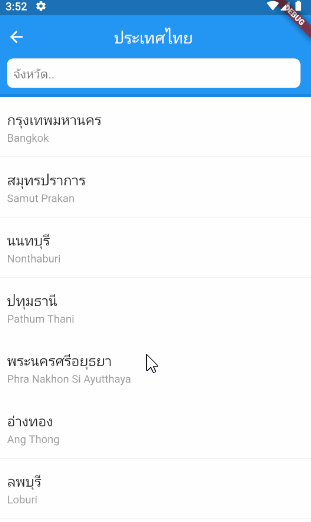
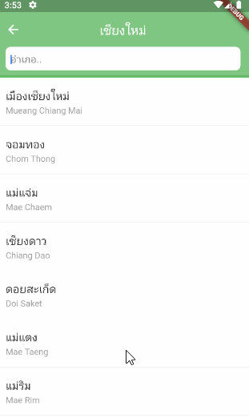
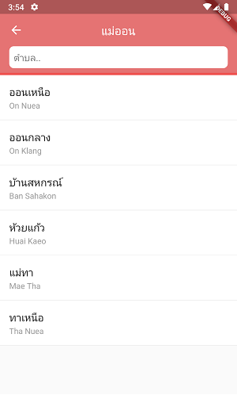
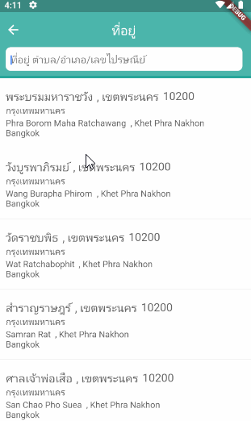

# Flutter Thailand Provinces

ฐานข้อมูลจังหวัด อำเภอ ตำบล หมายเลขไปรษณีย์ของประเทศไทย สำหรับใช้งานใน Flutter
เลือกจังหวักดผ่าน dialog อย่างง่ายๆ 

ฐานข้อมูล .sql จากคุณ parsilver แล้วแปลงเป็น .db สำหรับ SQLite เพื่อใช้งานใน Flutter
[https://github.com/parsilver/thailand-provinces](https://github.com/parsilver/thailand-provinces)

## การติดตั้ง

เพิ่ม dependencies ในไฟล์ pubspec.yaml

```bash
dependencies:
    flutter_thailand_provinces: 1.0.0
```

## การใช้งาน

ก่อนการใช้งานฐานข้อมูลจำเป็นต้องสร้างฐานข้อมูลจังหวัดก่อน

```dart
//import 'dart:async';
//import 'package:flutter_thailand_provinces/flutter_thailand_provinces.dart';

Future main() async {
  WidgetsFlutterBinding.ensureInitialized(); // ensure flutter initialized.
  await ThailandProvincesDatabase.init();    // initialize database.
  runApp(MyApp());
}
```

## ข้อมูลจังหวัด (Province)

การสืบค้น (query) ข้อมูลจังหวัดจะทำผ่าน ProvinceProvider จากนั้นคุณจะได้ List<ProvinceDao> ที่มีข้อมูลชื่อจังหวัดภายใน

```dart
//import 'package:flutter_thailand_provinces/provider/province_provider.dart';
//import 'package:flutter_thailand_provinces/dao/province_dao.dart';

var list = await ProvinceProvider.all();
for(ProvinceDao province in list){
   // province.nameTh;
   // province.nameEn;
   // province.id;
}
```


การค้นหาจังหวัดจากชื่อ

```dart
var list = await ProvinceProvider.search(keyword: "เชียงใหม่");
```

ตัวอย่างการใช้งาน



## ข้อมูลอำเภอ (Amphure)

การ query ข้อมูลอำเภอทำผ่าน AmphureProvider จากนั้นคุณจะได้ List<AmphureDao> ที่มีข้อมูลอำเภอ

เรียกดูรายการอำเภอทั้งหมด (ประเทศไทยมีอำเภอทั้งหมดประมาณ 1,000 อำเภอ)

```dart
//import 'package:flutter_thailand_provinces/provider/amphure_provider.dart';
//import 'package:flutter_thailand_provinces/dao/amphure_dao.dart';

var list = await AmphureProvider.all();
for(AmphureDao amphure in list){
   // amphure.id;
   // amphure.provinceId;
   // amphure.nameTh;
   // amphure.nameEn;
}
```

รายการอำเภอเฉพาะในจังหวัดนั้น คุณจำเป็นต้องทราบ provinceId 
เช่น provinceId = 1 คือ กรุงเทพฯ

```dart
var list = await AmphureProvider.all(provinceId : 1);
```

ค้นหาอำเภอ
```dart
var list = await AmphureProvider.search(keyword: "บาง");
```


ค้นหาอำเภอเฉพาะในจังหวัด
```dart
var list = await AmphureProvider.searchInProvince(provinceId: 1, keyword: "บาง");
```

ตัวอย่างการใช้งาน



## ข้อมูลตำบล (District)

การ query ข้อมูลตำบลทำผ่าน DistrictProvider จากนั้นคุณจะได้ List<DistrictDao> ที่มีข้อมูลตำบล
ประกอบไปด้วยชือ และหมายเลขไปรษณีย์

เรียกดูรายการทั้งหมด (ประเทศไทยมีตำบลทั้งหมดประมาณ 9,000 ตำบล)

```dart
//import 'package:flutter_thailand_provinces/provider/district_provider.dart';
//import 'package:flutter_thailand_provinces/dao/district_dao.dart';

var list = await DistrictProvider.all();
for(DistrictDao district in list){
   // district.id;
   // district.amphureId;
   // district.zipCode;
   // district.nameTh;
   // district.nameEn;
}
```

การเรียกดูตำบลทั้งหมดในอำเภอ จะต้องใช้ amphure id

```dart
var list = await DistrictProvider.all(amphureId: 1001);
```

การค้นหาตำบลจากในอำเภอ

```dart
var list = await DistrictProvider.searchInAmphure(amphureId: 1001, keyword: "แม่เมาะ");
```


ตัวอย่างการใช้งาน



## ข้อมูลที่อยู่ (Address)

Address คือ การนำข้อมูล จังหวัด อำเภอ และตำบลมา join กัน โดยการ query ข้อมูลจะทำผ่าน AddressProvider จากนั้นคุณจะได้ List<AddressDao> ซึ่งใน AddressDao จะมีข้อมูล 3 ส่วนคือ ProvinceDao, AmphureDao, DistrictDao นั่นเอง

การ query ข้อมูล address ทั้งหมด

```dart
//import 'package:flutter_thailand_provinces/provider/address_provider.dart';
//import 'package:flutter_thailand_provinces/dao/address_dao.dart';

var list = await AddressProvider.all();
for(AddressDao address in list){
   // address.province;
   // address.amphure;
   // address.district;
}
```

ข้อมูล address เฉพาะในจังหวัด
```dart
var list = await AddressProvider.all(provinceId: 1);
```

ค้นหาโดยใช้คำค้น (keyword)

```dart
var list = await AddressProvider.search(keyword: "นา");
```

ค้นหาโดยใช้คำค้น (keyword) เฉพาะในจังหวัด

```dart
var list = await AddressProvider.searchInProvince(provinceId: 1, keyword: "101");
```

ตัวอย่างการใช้งาน



## การใช้ Dialog เลือกจังหวัด
หากต้องการเลือกจังหวัดแบบรวดเร็ว สามารถเรียกใช้ ChooseProvinceDialog 
```dart
var list = await ProvinceProvider.all();
ProvinceDao province = await ChooseProvinceDialog.show(context, listProvinces: list);
```

การ custom style ของ ChooseProvinceDialog สามารถกำหนดสีและ font-family ได้


```dart
var list = await ProvinceProvider.all();
ProvinceDao province = await ChooseProvinceDialog.show(context,
                    listProvinces: list,
                    colorBackgroundHeader: Colors.purple[300],
                    colorLineHeader: Colors.purple[500],
                    styleTitle: TextStyle(fontSize: 18, fontFamily: "Kanit-Regular"),
                    styleSubTitle: TextStyle(fontSize: 14, fontFamily: "Kanit-Regular", 
                                       color: Colors.grey[400]),
                    styleTextNoData: TextStyle(fontFamily: "Kanit-Regular"),
                    styleTextSearchHint: TextStyle(fontFamily: "Kanit-Regular"),
                    styleTextSearch: TextStyle(fontFamily: "Kanit-Regular"));
                  
```

